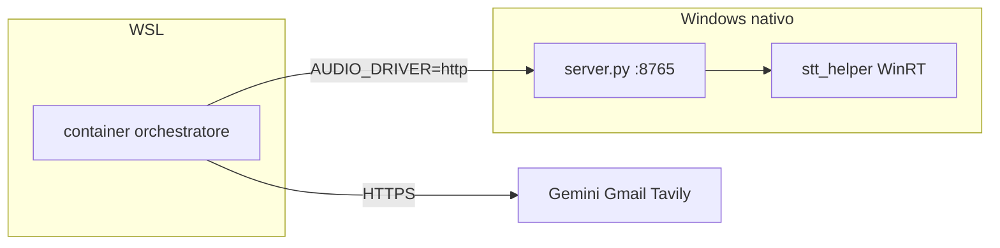

# Docker: orchestratore in un container (studio)

Percorso **didattico**: Docker è un secondo modo di avviare lo stesso CLI `lavora-e-guida`, non un secondo prodotto. Un solo servizio Compose (`app`). L’I/O audio hands-free resta [`windows_audio/server.py`](../windows_audio/server.py) su Windows; OAuth Gmail resta il CLI `lavora-e-guida-gmail-auth` nel venv WSL.

Il quick start venv (`source .venv/bin/activate` e `lavora-e-guida`) non cambia: è ancora il default del [README](../README.md). Questa pagina è una sequenza di esercizi da eseguire in ordine. Non è un dump dello YAML.



---

## Cosa non va su GitHub (né nell’immagine)

Il [`.gitignore`](../.gitignore) e il [`.dockerignore`](../.dockerignore) fanno due mestieri diversi: uno protegge `git add`, l’altro protegge i layer di `docker build`. Nessuno dei due sostituisce l’altro.

| Cosa | GitHub / git | Immagine Docker |
| --- | --- | --- |
| `.env` con chiavi vere | No (già ignorato) | No: `env_file` a **runtime**, nessuna `COPY` |
| `runtime/gmail_token.json`, `client_secret*.json` | No | No: volume `./runtime:/index` se il token esiste già |
| DB Chroma / SQLite in `runtime/` | No (`runtime/*` ignorato) | No: stesso volume |
| `.env.example` (chiavi **vuote**) | Sì | Non serve all’immagine |
| Codice, `Dockerfile`, `docker-compose.yml` | Sì | Sì (solo `pyproject.toml`, `README.md`, `src/` nel layer) |
| `docs/` | Sì (chi clona li prende dal git) | L’immagine non li contiene: il Dockerfile non li copia |

`GMAIL_USER=account@gmail.com` in `.env.example` è un placeholder, non un account reale. Se in passato la cartella è stata zip/copiata con chiavi vere, ruotare a mano su Google Cloud e Tavily: questo progetto non ruota nulla in automatico.

OAuth Gmail **non** si fa nel container: il redirect `http://127.0.0.1` del client Desktop arriva al browser Windows, non al processo Linux in Docker. Consenso a tavolino in WSL (`lavora-e-guida-gmail-auth`, [gmail_oauth.md](gmail_oauth.md)), poi si monta `runtime/` se `gmail_token.json` esiste.

Audio **non** si mette in Compose: niente secondo servizio `audio`, niente `docker compose` di `windows_audio`. Hands-free = host Windows già in ascolto e `AUDIO_DRIVER=http` nel `.env` **locale**.

---

## Glossario (analogia al venv WSL)

Cinque parole. Compose ha **un** servizio `app`: non c’è un secondo container STT/TTS.

| Termine | In questo progetto | Analogia venv |
| --- | --- | --- |
| **Immagine** | Ricetta congelata (`Dockerfile` / `docker compose build`): Python 3.12 + pacchetto, non gira da sola | Wheel + interprete, ancora senza processo |
| **Container** | Processo vivo avviato da quell’immagine (`docker compose run --rm app`) | `.venv` + comando `lavora-e-guida` |
| **Volume** | Cartella dell’host montata dentro: Desktop → `/workspace`, `runtime/` → `/index` | Il disco del venv non è il Desktop: i file utente stanno fuori |
| **env_file** | Il `.env` letto **a avvio**, non bake nell’immagine | `source .env` (o pydantic-settings), non `pip install` delle chiavi |
| **host.docker.internal** | Nome DNS verso l’host Windows/WSL, per `:8765` | In WSL nativo è il nameserver di `/etc/resolv.conf`; in Docker quel file punta a `127.0.0.11` |

Dentro il container Compose **sovrascrive** `WORKSPACE_ROOT=/workspace` e `INDEX_ROOT=/index`. Sul host WSL i path restano quelli del venv (`/mnt/c/...`, `<repo>/runtime`). Non copiare `/workspace` nel `.env` usato dal venv.

---

## D0. Prerequisito: daemon acceso

Da WSL, nella root del repo:

```bash
docker version
docker compose version
```

**Cosa osservare:** client e server con una versione; `docker compose` (plugin V2) risponde. Docker Desktop (o engine in WSL) deve essere acceso.

**Errore tipico:** `Cannot connect to the Docker daemon` — il resto di questa pagina fallisce tutti allo stesso modo. Accendere Docker Desktop e ritentare D0 prima di D1.

---

## D1. Hello world (run vs immagine)

```bash
docker run --rm hello-world
docker images
docker ps -a
```

**Cosa osservare:** il primo comando scarica l’immagine `hello-world` se manca, stampa il messaggio di Docker, esce. `--rm` = il **container** sparisce a fine processo. `docker images` mostra ancora l’**immagine** in cache. `docker ps -a` non deve elencare quel container (è stato rimosso).

**Errore tipico:** stesso di D0 se il daemon è spento. Se `docker images` è vuoto dopo un run andato a buon fine, si sta guardando un altro contesto Docker (context `desktop-linux` vs `default`): `docker context show`.

---

## D2. Un Python usa e getta (`-it` e stdin)

```bash
docker run --rm -it python:3.12-slim-bookworm python -c "print('ok')"
```

Poi, stessa immagine, shell interattiva:

```bash
docker run --rm -it python:3.12-slim-bookworm python
```

Dentro l’interprete: `print(2+2)`, poi Ctrl+D per uscire.

**Cosa osservare:** `-i` tiene stdin aperto, `-t` alloca un TTY. Senza questa coppia la riga `Tu (mock STT)>` del loop vocale non è usabile. Il mock STT ha bisogno di `-it` come questa shell. `--rm` di nuovo: processo finito, container sparito; l’immagine `python:3.12-slim-bookworm` resta (la userà anche il Dockerfile).

**Errore tipico:** `the input device is not a TTY` — il comando gira in un contesto senza terminale (pipe, CI). In una shell WSL interattiva non succede. `docker run` senza `-it` parte, stampa `ok` e basta: non è un errore, è il motivo per cui D6 e D7 tengono TTY.

---

## D3. Rete in uscita (Gemini dal container)

```bash
docker run --rm python:3.12-slim-bookworm python -c "import urllib.request; print(urllib.request.urlopen('https://www.google.com', timeout=10).status)"
```

**Cosa osservare:** stampa `200`. Il container raggiunge Internet in HTTPS. Il loop vocale userà lo stesso tipo di uscita verso Gemini (e Tavily, Gmail REST).

**Errore tipico:** timeout o `URLError` — DNS o firewall del daemon, VPN, Docker Desktop «Block DNS». Se questo fallisce, il ping Gemini in Docker fallirà allo stesso modo: non è un bug del CLI. Sistemare la rete del daemon prima di D6.

---

## D4. Volume (il disco del container è usa e getta)

```bash
mkdir -p /tmp/docker-vol-demo
echo ciao > /tmp/docker-vol-demo/nota.txt
docker run --rm -v /tmp/docker-vol-demo:/data python:3.12-slim-bookworm cat /data/nota.txt
```

**Cosa osservare:** stampa `ciao`. Il file vive sull’**host**; il container lo vede sotto `/data`. Se ometti `-v` e scrivi dentro il container, al `--rm` il contenuto sparisce.

**Errore tipico:** `no such file or directory` — path host sbagliato o cartella non creata. Stesso meccanismo di `HOST_WORKSPACE:/workspace` in Compose: se `HOST_WORKSPACE` manca, il mount è `:/workspace` e Docker si ferma in modo visibile (meglio che scrivere sul volume sbagliato in silenzio).

---

## D5. Build dell’orchestratore

I file `Dockerfile`, `.dockerignore` e `docker-compose.yml` devono già esistere nella root del repo. Dalla stessa directory:

```bash
docker build -t lavora-e-guida:local .
```

**Cosa osservare:** layer `apt-get` (`libgomp1`, serve a onnxruntime/Chroma a runtime), `COPY pyproject.toml README.md` e `COPY src/`, poi `pip install`. **Non** deve comparire nel log una lettura o `COPY` di `.env`. Verifica:

```bash
docker history lavora-e-guida:local
```

Nessun layer `COPY .env`. Il `.dockerignore` tiene `.env`, `runtime/`, `.venv/` e i token **fuori dal context**: anche se qualcuno scrivesse `COPY . .` per sbaglio, i secret non partirebbero verso il daemon.

`docs/` resta nel context (i manuali sono pubblici, placeholder `account@gmail.com`). L’immagine comunque non li contiene: il Dockerfile non li copia. Ignorarli avrebbe solo accorciato l’invio al daemon, non un motivo di privacy.

**Errore tipico:**

- `failed to solve` / pacchetto Debian mancante — se `libgomp1` non basta su un’architettura strana, il log apt lo dice; non gonfiare la ricetta «per sicurezza».
- `COPY failed: file not found` — si è lanciato `docker build` fuori dalla root (manca `pyproject.toml` nel context).
- Build lentissimo a ogni edit markdown — non è questo Dockerfile: qui `docs/` non invalida `pip install` perché non è in un `COPY`.

---

## D6. Primo avvio mock (senza Compose)

Copiare `.env.example` → `.env` **solo se manca**. In locale le chiavi ci sono già: **non** ricreare il file da zero. Serve almeno `GEMINI_API_KEY`. Decommentare `HOST_WORKSPACE` nel `.env` (es. `/mnt/c/Users/User/Desktop/Ollama_test`, cambiando User e cartella).

```bash
mkdir -p runtime
docker run --rm -it \
  --env-file .env \
  -e WORKSPACE_ROOT=/workspace \
  -e INDEX_ROOT=/index \
  -e AUDIO_DRIVER=mock \
  -v "$PWD/runtime:/index" \
  -v "${HOST_WORKSPACE:-$PWD/runtime}:/workspace" \
  lavora-e-guida:local
```

Digitare una frase (es. `Ciao`), Invio, poi `esci`.

**Cosa osservare:** prompt mock (`Tu (mock STT)>`), risposta stampata come TTS di studio, uscita pulita. `-e` vince su `--env-file`: i path nel container sono `/workspace` e `/index` (Linux), anche se il `.env` del venv ha `/mnt/c/...`. Obiettivo dell’esercizio: capire **env_file vs `-e`**. `AUDIO_DRIVER=mock` qui è esplicito così un `.env` già su `http` non tenta `:8765` in questo step.

**Errore tipico:**

- `GEMINI_API_KEY` vuota — fail-fast del CLI, come nel venv.
- Volume workspace inesistente — creare la cartella Desktop o esportare `HOST_WORKSPACE` nella shell prima del `docker run`.
- Senza `-it` il mock non legge la frase.

---

## D7. Stesso avvio con Compose

Perché Compose: un file invece di dieci flag. `HOST_WORKSPACE` deve essere decommentato nel `.env` del progetto (Compose lo interpola nello YAML). `AUDIO_DRIVER` nel file committato è `${AUDIO_DRIVER:-mock}`: chi clona resta sul mock senza toccare l’audio.

```bash
docker compose build
docker compose run --rm app
```

Stesso smoke di D6: una riga, poi `esci`. Argomenti dopo il servizio: `docker compose run --rm app --agent fs` (entrypoint `lavora-e-guida`, gli argv si concatenano).

**Cosa osservare:** stessa CLI, meno flag. `stdin_open` / `tty` nello YAML coprono il mock. `docker compose down` **non** serve se non ci sono servizi staccati (`run` è foreground: quando esci, il container con `--rm` sparisce).

**Errore tipico:**

- `env file .env not found` — copiare da `.env.example` (D6).
- `invalid spec: :/workspace` — `HOST_WORKSPACE` vuoto o ancora commentato.
- Compose che parte in `http` senza volerlo — `AUDIO_DRIVER=http` nel `.env` locale vince sull’interpolazione; per questo esercizio rimettere `mock` oppure `AUDIO_DRIVER=mock docker compose run --rm app`.

---

## D8. Hands-free (opzionale, stesso container)

Non è un secondo servizio. Stesso `app`, stesso volume, stesso Gemini. Cambia solo il driver audio e dove punta `WINDOWS_HOST`.

1. Su Windows: avviare `server.py` come in [audio_host.md](audio_host.md). Verifica `curl.exe -sS http://127.0.0.1:8765/health` → `helper` true.
2. Nel `.env` **locale** (mai nel `docker-compose.yml` committato): `AUDIO_DRIVER=http` e `WINDOWS_HOST=host.docker.internal`. In Docker la discovery da `/etc/resolv.conf` punta al DNS interno `127.0.0.11`, **non** all’IP Windows: lasciare `WINDOWS_HOST` vuoto qui è l’errore classico.
3. Firewall 8765: oltre alla NAT WSL, consentire il traffico dalla subnet Docker Desktop (o la regola già aperta su rete privata). La 8766 resta loopback Windows.
4. `docker compose run --rm app` e attendere l’intro Elsa.

**Cosa osservare:** intro parlata, poi ascolto della wake. Il container parla HTTPS verso Gemini e HTTP verso `host.docker.internal:8765`. `extra_hosts: host.docker.internal:host-gateway` nello YAML esiste per WSL2, dove quel nome DNS non c’è di default.

**Errore tipico:** `connect timeout` — host `server.py` spento, firewall, o `WINDOWS_HOST` ancora vuoto. `curl` da WSL verso il nameserver può funzionare mentre dal container no: sono due reti. Non si sistema con un secondo container audio.

---

## D9. Cosa non fare

- `COPY` del `.env` nel Dockerfile «per comodità»: le chiavi finirebbero in ogni layer e in `docker history`. Si inietta a runtime (`env_file` / `--env-file`).
- OAuth Gmail **dentro** il container: il redirect `127.0.0.1` non è il browser Windows. Consenso in WSL, volume `./runtime:/index` se il token c’è.
- `docker compose` di `windows_audio`: quel processo è nativo WinRT + edge-tts, non un’immagine Linux.
- Mettere `AUDIO_DRIVER=http` o `WINDOWS_HOST=host.docker.internal` nel Compose **committato**: il default per chi clona è mock (codice + `${AUDIO_DRIVER:-mock}` + `.env.example`).
- Usare `--llm ollama` nel container come «backup» del loop vocale: è fail-fast parlante, extra di studio, non il prodotto.

---

## D10. Pulizia (non lasciare spazzatura)

```bash
docker compose down
docker image ls
```

**Cosa osservare:** `down` ferma eventuali servizi `up` (con solo `run --rm` spesso non c’è nulla da fermare). `docker image ls` mostra ancora `lavora-e-guida` (build locale) e `python:3.12-slim-bookworm` (cache di D2/D5). Le immagini **non** spariscono da sole: è voluto, il rebuild è più veloce.

Opzionale, solo se si vuole rifare da zero:

```bash
# docker rmi lavora-e-guida:local
```

I volumi bind (`HOST_WORKSPACE`, `./runtime`) **non** si cancellano con `down`: sono cartelle dell’host. Non usare `docker volume prune` pensando di pulire il Desktop.

**Errore tipico:** `image is being used by running container` su `rmi` — un `compose run` senza `--rm` o un `up -d` lasciato acceso. `docker ps`, poi `docker compose down` o `docker stop`.

---

## Dove sta il resto

| Argomento | Pagina |
| --- | --- |
| Host audio Windows, firewall 8765, wake | [audio_host.md](audio_host.md) |
| Consenso Gmail a tavolino (venv WSL) | [gmail_oauth.md](gmail_oauth.md) |
| Chiave Tavily | [tavily_web.md](tavily_web.md) |
| Quick start venv | [README](../README.md) |
