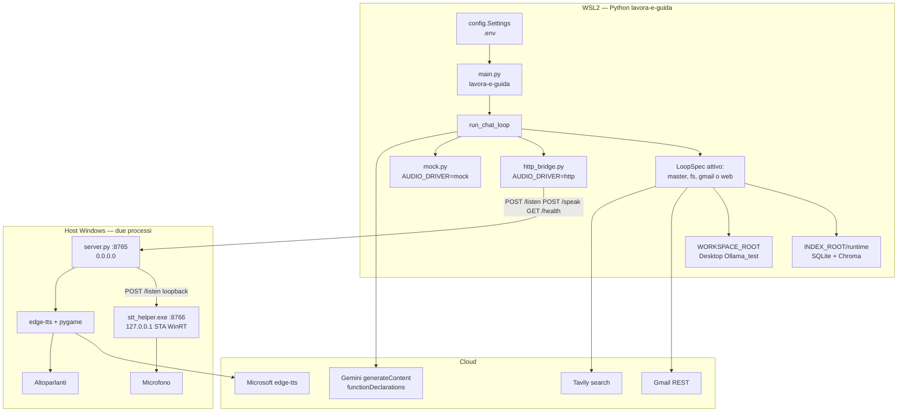
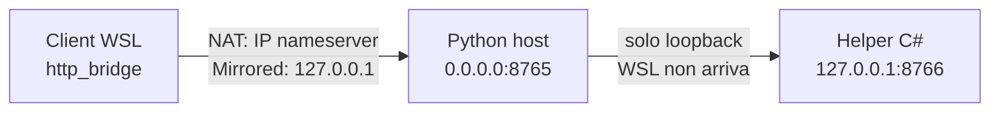
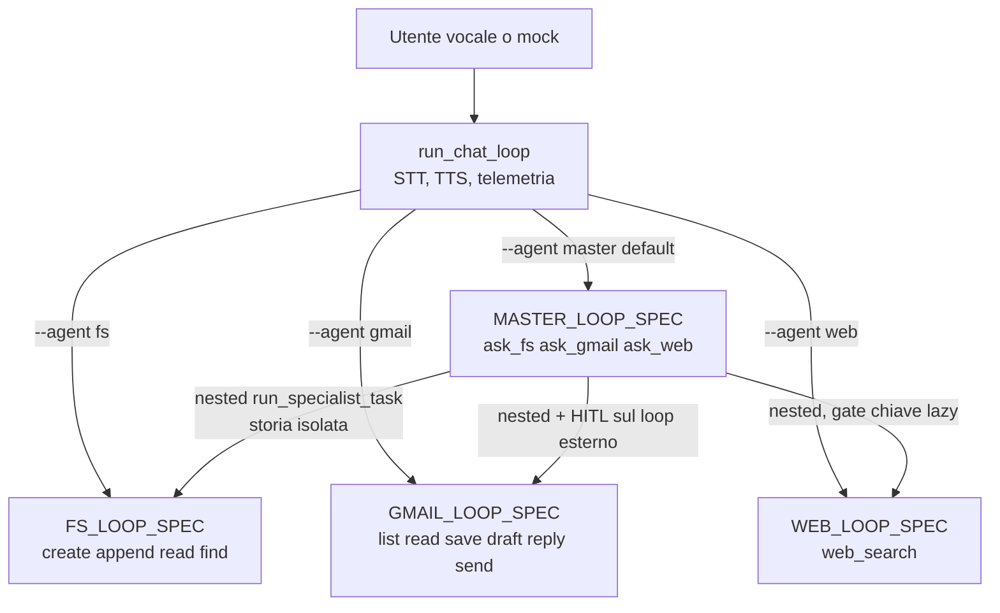
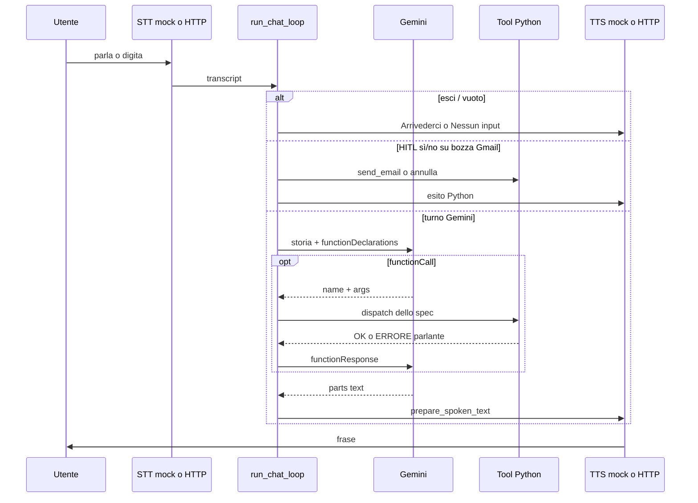

# Flowchart dell’ecosistema

Mappe Mermaid del runtime vocale. Ogni pagina è un dominio: i diagrammi restano leggibili in preview Markdown.

| Pagina | Cosa copre |
| --- | --- |
| Questa | Vista d’insieme: processi, porte, agenti, dati |
| [Avvio e loop vocale](flowchart_avvio_e_loop.md) | CLI `lavora-e-guida`, fail-fast, `run_chat_loop`, function calling Gemini |
| [Router master](flowchart_master.md) | `ask_fs` / `ask_gmail` / `ask_web`, storie isolate, flusso composto |
| [Host audio Windows](flowchart_audio.md) | `server.py` :8765, helper C# :8766, half-duplex, tre wake, TTS |
| [Gmail](flowchart_gmail.md) | OAuth a tavolino, tool mailbox, HITL sì/no sull’invio |
| [File e RAG](flowchart_fs_rag.md) | Desktop, sync indice, `find_file`, hook post-scrittura |

Documentazione operativa (non flowchart): [README](../README.md), [audio host](audio_host.md), [OAuth Gmail](gmail_oauth.md), [Tavily](tavily_web.md), [Ollama studio](ollama.md).

## Vista d’insieme: due macchine

L’orchestratore vive in **WSL2**. Microfono e altoparlanti vivono sull’**host Windows**. Gemini, Gmail e Tavily sono servizi cloud. Qwen 2.5 3B via Ollama non entra nel loop vocale (`--llm ollama` è fail-fast parlante).

## Porte e chi può vederle

In NAT, `WINDOWS_HOST` vuoto usa il nameserver di `/etc/resolv.conf`. In mirrored va impostato `WINDOWS_HOST=127.0.0.1`. Dettaglio: [audio host](audio_host.md#rete-wsl-nat-vs-mirrored).

## Quattro agenti, un motore

Il motore (`agent.py`) non possiede un catalogo di dominio. Ogni agente passa un `LoopSpec` (prompt, `functionDeclarations`, dispatch, HITL). Il default del loop è il **router master**.

Un tool **eseguito** per round Gemini. Se il modello ne propone due, Python prende la prima `functionCall`. Più round nello stesso enunciato: fino a 4 (`_MAX_TOOL_ROUNDS`). Esempio composto: «Cerca il meteo e mandalo a Mario» → round 1 `ask_web`, round 2 `ask_gmail`. Nessun file sul Desktop se non è stato chiesto.

## Dati: due root

| Concetto | Path | Chi lo tocca |
| --- | --- | --- |
| File utente | `WORKSPACE_ROOT` (Desktop) | master e `--agent fs`; Gmail scrive solo `email_attachments/` |
| Stato locale | `INDEX_ROOT` (`runtime/` nel repo) | SQLite + Chroma, `telemetry.db`, `gmail_token.json` |

Gmail e web isolati **non** chiamano `ensure_workspace` né il sync RAG all’avvio.

## Turno vocale in una riga

Il dettaglio di ogni rombo (fail-fast, nested, wake, OAuth) sta nelle pagine collegate in cima.
