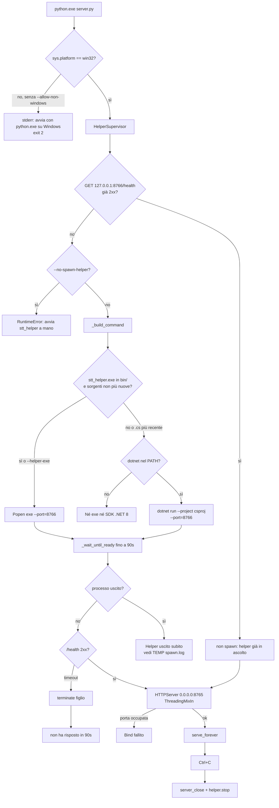
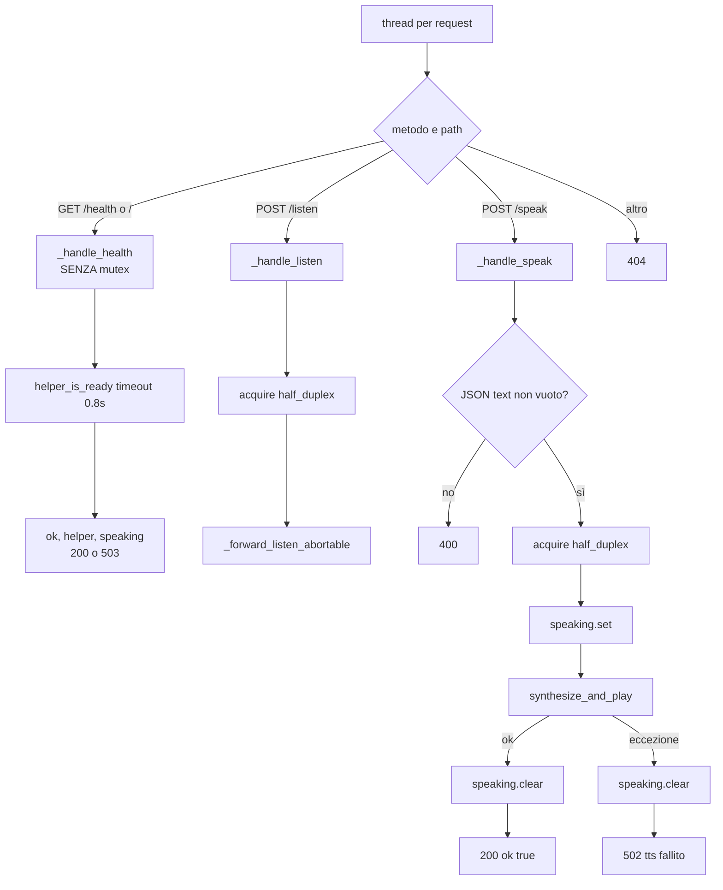
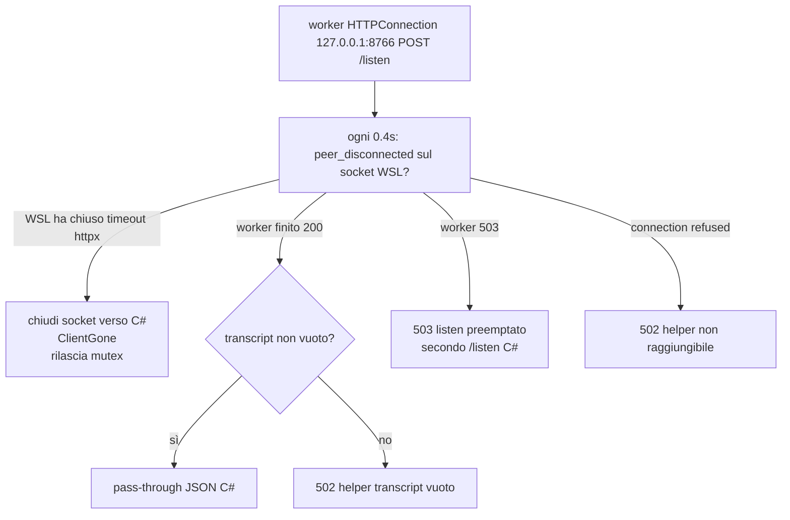
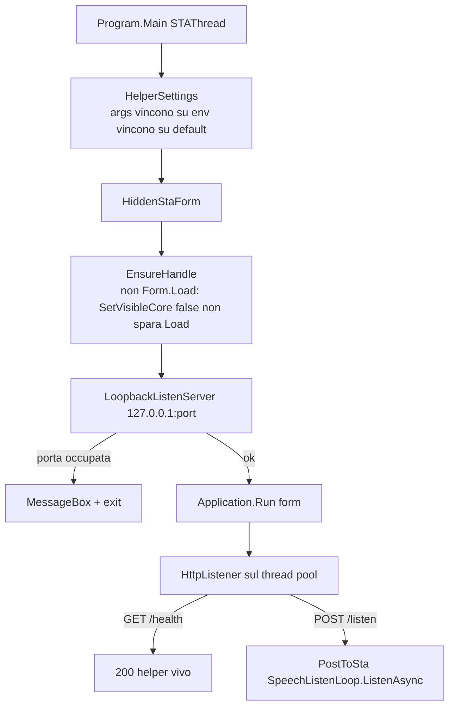
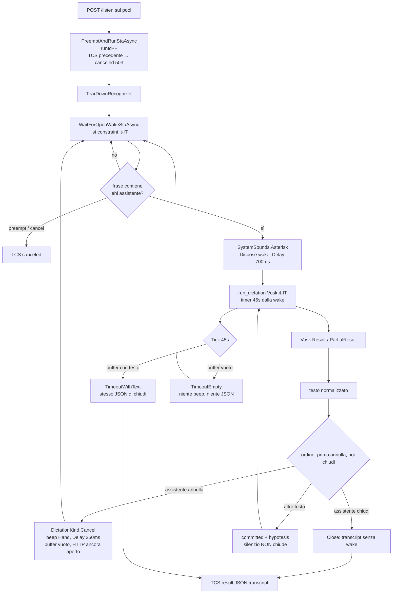
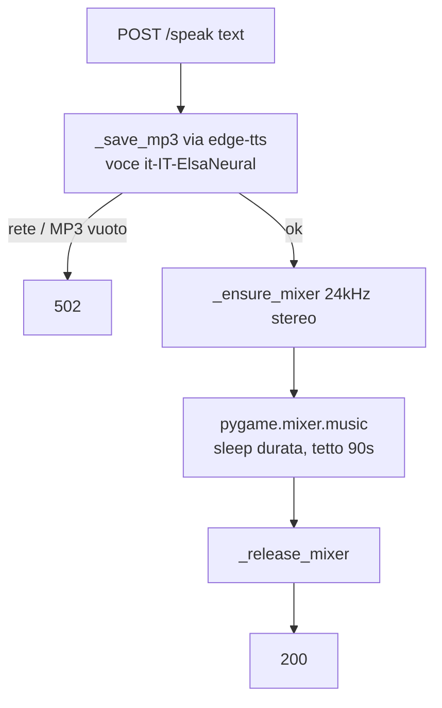
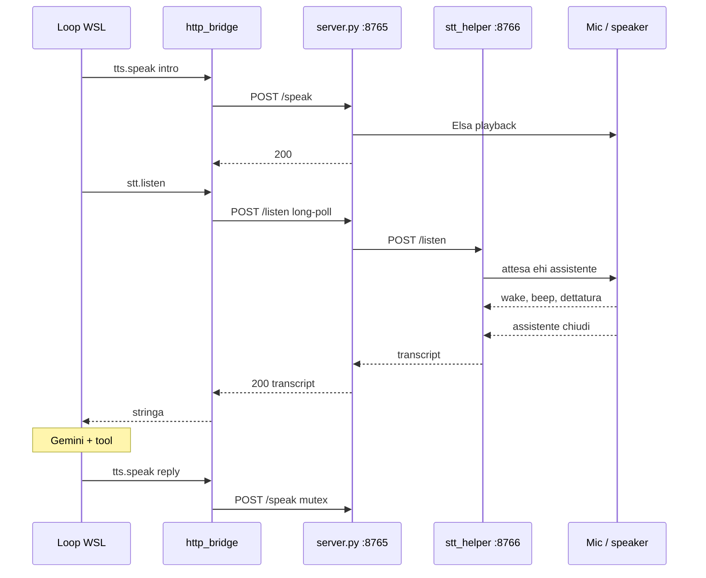
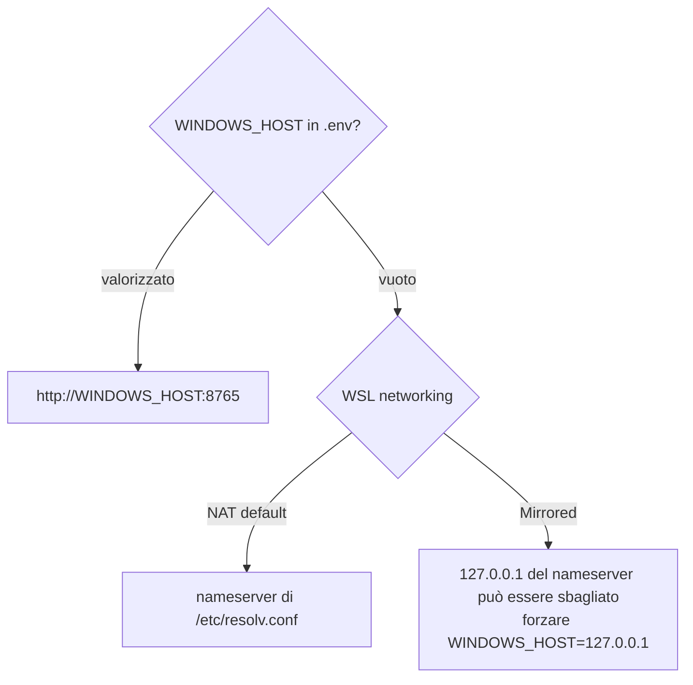

# Flowchart: host audio Windows

Indice: [flowchart.md](flowchart.md). Operativo: [audio_host.md](audio_host.md). Codice: [`windows_audio/server.py`](../windows_audio/server.py), [`helper_spawn.py`](../windows_audio/helper_spawn.py), [`stt_helper/`](../windows_audio/stt_helper/), client WSL [`http_bridge.py`](../src/lavora_e_guida/audio/http_bridge.py).

Due processi **solo su Windows**, avvio unico dal Python host. WSL non deve eseguire `server.py` (fail-fast, codice 2).

## 1. Avvio host: spawn helper e bind

`CREATE_NEW_PROCESS_GROUP` su Windows: Ctrl+C nella console Python non abbatte il figlio prima del `finally`. `stop` termina solo il pid spawnato da questo processo, non un helper riusato.

Log: `%TEMP%\audio_host_helper_spawn.log` (dotnet/spawn) e `%TEMP%\stt_helper.log` (WinExe, niente console).

## 2. Contratto HTTP verso WSL

Half-duplex: niente `/listen` mentre parla Elsa (il mic WinRT non deve sentirla). `/health` non prende il lock, così un probe non resta in coda dietro un ascolto di minuti.

## 3. Inoltro `/listen` e client WSL staccato

Il tetto vero è `AUDIO_LISTEN_TIMEOUT_SEC` lato WSL (300s). L’host inoltra **senza** timeout verso :8766. Un transcript vuoto **non** si inoltra: il loop WSL direbbe «Nessun input. Uscita.»

Chiudere la socket verso C# **non** ferma WinRT: serve un nuovo `POST /listen` per preempt. Serve a sbloccare il thread Python e il mutex.

## 4. Helper C#: processo STA

WinRT `SpeechRecognizer` è COM/STA. `Application.Run` su form nascosta pompa i messaggi. Un thread nudo con `Sleep` non consegna hypotesis.

Wake default (tre parole, così un «chiudi» isolato in una mail non chiude il turno):

| Fase | Default env | Effetto |
| --- | --- | --- |
| Apertura | `WAKE_OPEN` = ehi assistente | beep Asterisk, passa a dictation |
| Chiusura | `WAKE_CLOSE` = assistente chiudi | JSON senza la wake |
| Annulla | `WAKE_CANCEL` = assistente annulla | scarta buffer, beep Hand, **stesso** HTTP aperto |

Alias: list-constraint accetta anche «hei assistente» (forma parlata di «ehi» in WinRT it-IT).

## 5. Macchina a stati di un `POST /listen`

Un riconoscitore per volta: list-constraint sulla wake, **Dispose**, poi topic Dictation su un `SpeechRecognizer` **nuovo**. Mai due motori sullo stesso mic.

Timeout silenzio WinRT: in dettatura `EndSilence` corto (1–2s) così arriva `ResultGenerated`; `AutoStopSilence` al massimo accettato dalla build. Il tetto di **turno** resta il timer 45s. Dopo la wake si **Dispose** e si crea un riconoscitore nuovo con topic Dictation (ricompilare list→topic sullo stesso oggetto fallisce). Compile topic fallisce senza «Riconoscimento vocale online» (Impostazioni → Privacy → Comandi vocali) e rete Microsoft.

## 6. TTS: edge-tts + pygame

200 a WSL solo a **playback finito**. Mixer init al primo speak, quit dopo ogni frase (altrimenti il device resta preso e il mic ronza).

Il testo arriva già pulito da `prepare_spoken_text` in WSL. Dipendenze nel venv **Windows** (`windows_audio/requirements.txt`), non in `pyproject.toml` WSL.

## 7. Turno vocale end-to-end con `AUDIO_DRIVER=http`

## 8. NAT vs mirrored (solo discovery)

La 8766 non va aperta sul firewall. La 8765 sì, verso WSL (rete privata).
