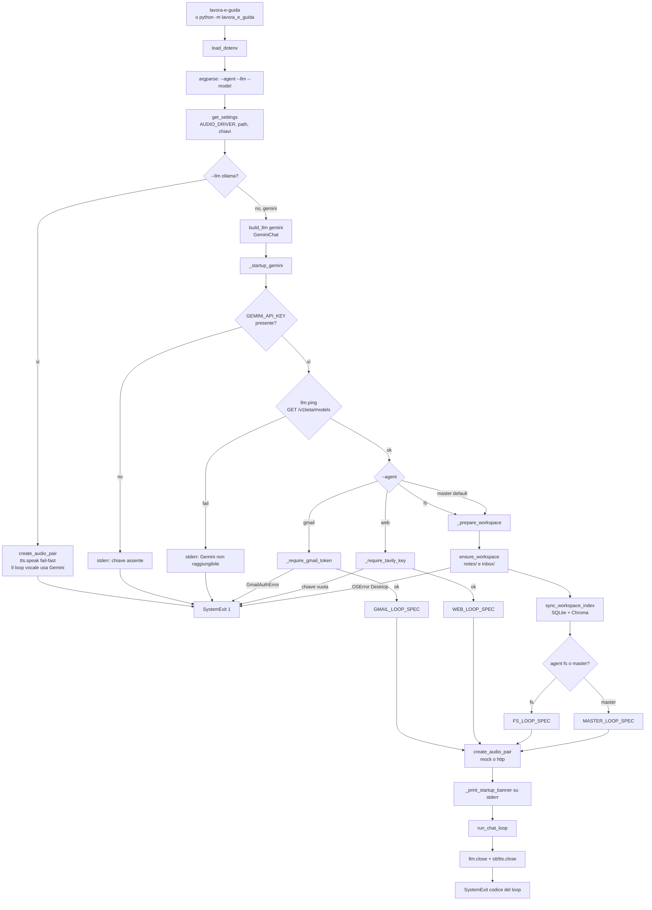
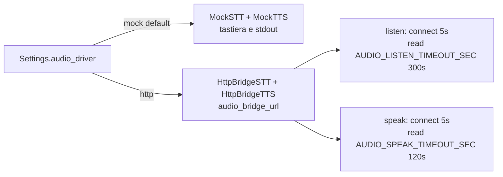
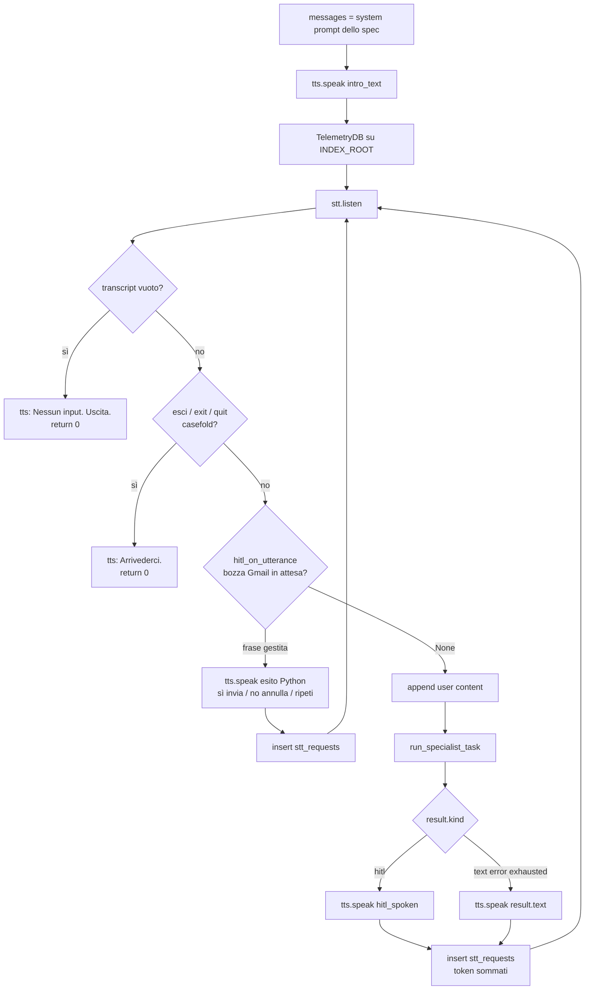
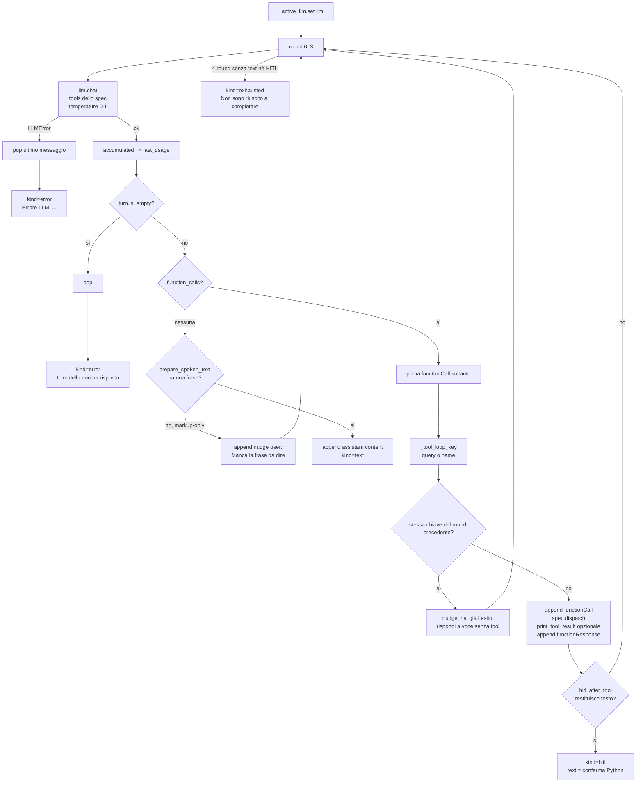
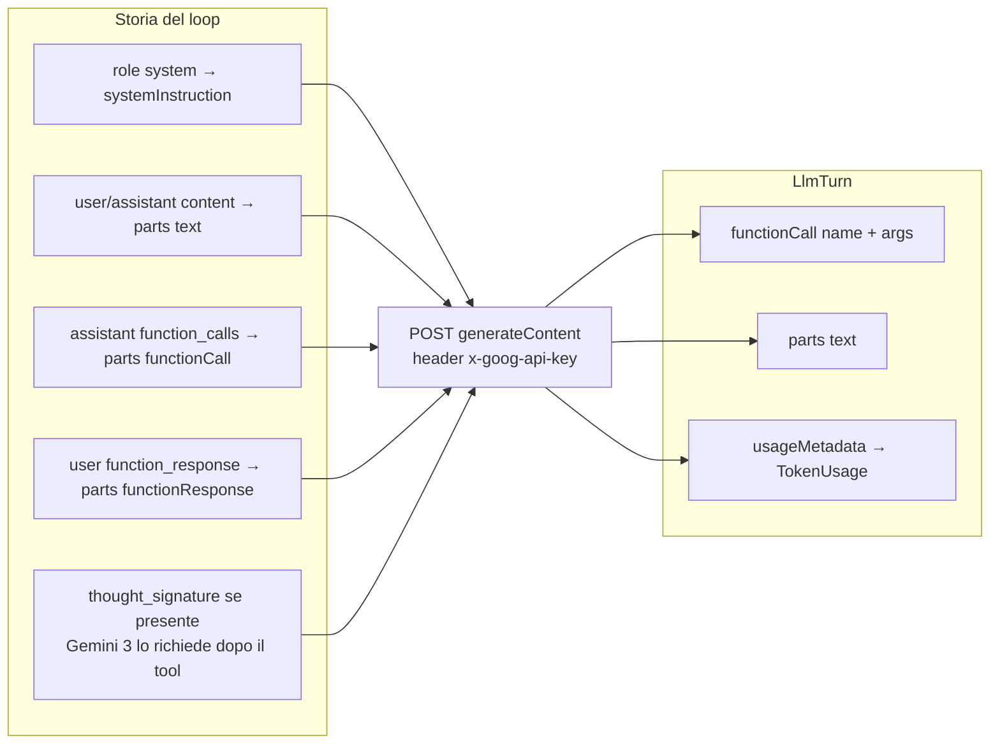
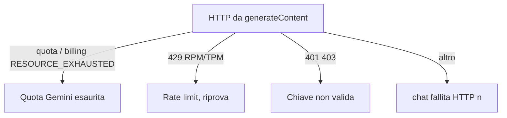

# Flowchart: avvio CLI e loop vocale

Indice: [flowchart.md](flowchart.md). Codice: [`main.py`](../src/lavora_e_guida/main.py), [`agent.py`](../src/lavora_e_guida/agent.py), [`llm/cloud.py`](../src/lavora_e_guida/llm/cloud.py).

## 1. `main()`: dal comando al loop

`--llm ollama` non costruisce Qwen: parla, esce con codice 1. Gemini è l’unico provider del loop.

Note sui gate:

- **master** prepara Desktop/RAG perché `ask_fs` ne ha bisogno. Token Gmail e chiave Tavily sono **lazy** nel dispatch (`ask_gmail` / `ask_web`), non all’avvio.
- **gmail** e **web** isolati non toccano workspace né Chroma.
- Banner master: `tools=ask_fs,ask_gmail,ask_web`. Banner fs: create/append/read/find. Banner gmail: list/read/save/draft/reply/send. Banner web: `web_search`.

## 2. Factory audio

URL: `http://{WINDOWS_HOST o nameserver}:{WINDOWS_AUDIO_PORT}`. Contratto host: [flowchart audio](flowchart_audio.md).

## 3. `run_chat_loop`: un turno

TTS parla solo sull’esito (intro, HITL, reply Gemini, errore). Lo specialista nested **non** chiama `tts.speak`.

Una riga telemetria per turno vocale valido: non intro, non riga vuota, non `esci`.

## 4. `run_specialist_task`: fino a 4 round, senza TTS

Stesso giro per il loop esterno e per il nested del master. Bind `get_active_llm` via contextvar: `ask_*` riusa lo stesso `GeminiChat`.

Anti-ripetizione: `find_file` / `list_emails` / `web_search` usano `query`; `read_file` / `read_email` usano `name`. Stessa call di fila → niente secondo dispatch, solo nudge parlato.

## 5. Gemini: storia → `generateContent`

Niente `responseMimeType: application/json` insieme ai tool: confligge con `functionCall`. Reply parlata = `parts[].text`, non un JSON `tool=none`. Prima del TTS, `prepare_spoken_text` toglie markdown residuo.

## 6. Errori Gemini mappati in italiano

Il loop parla quella frase (`kind=error`) e torna in ascolto. La storia toglie l’ultimo user message così un retry non riparte a metà.
