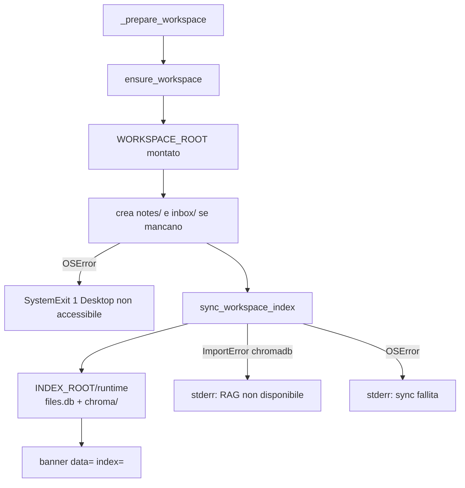
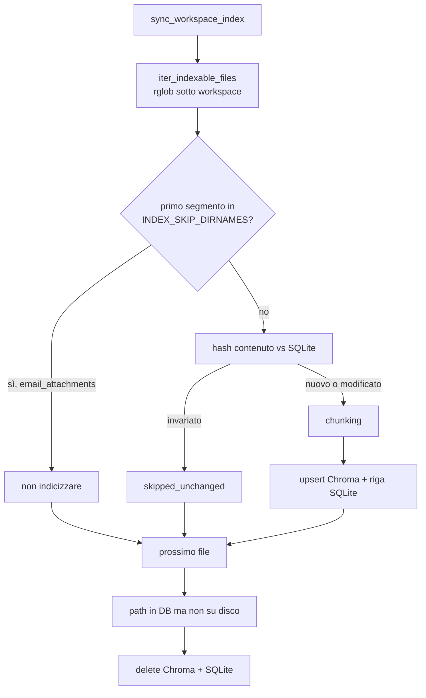
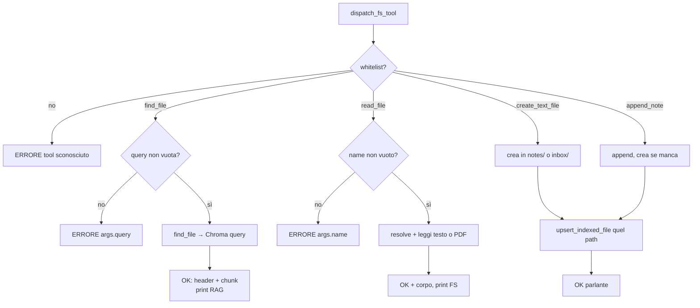
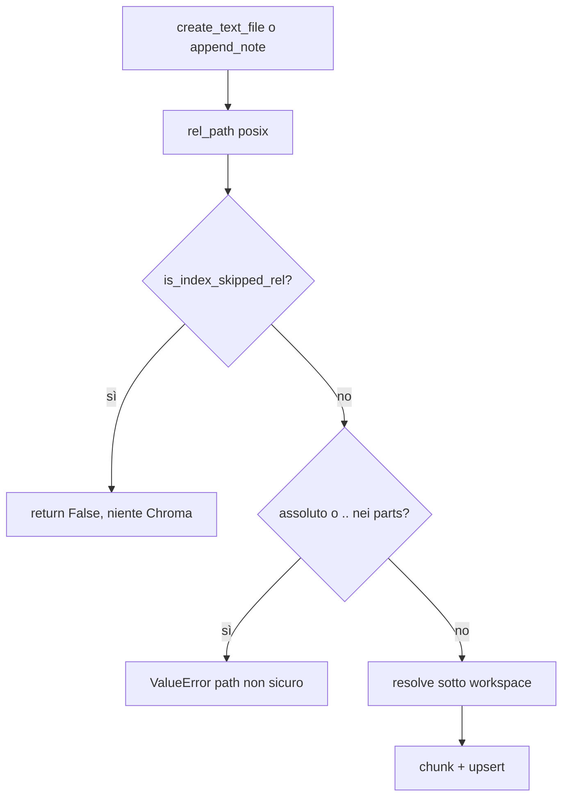
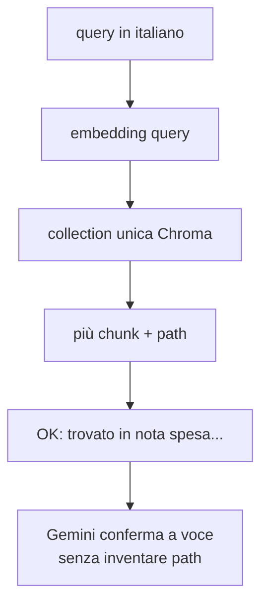

# Flowchart: workspace, file e RAG

Indice: [flowchart.md](flowchart.md). Codice: [`fs/files.py`](../src/lavora_e_guida/fs/files.py), [`fs/find.py`](../src/lavora_e_guida/fs/find.py), [`fs/file_resolver.py`](../src/lavora_e_guida/fs/file_resolver.py), [`rag/index_sync.py`](../src/lavora_e_guida/rag/index_sync.py).

Collection Chroma **unica** sotto `INDEX_ROOT`. I path in SQLite sono relativi al data workspace. `email_attachments/` è skip: fatture scaricate non mescolano le note in `find_file`.

## 1. Due root all’avvio (master e `--agent fs`)

Gmail e web isolati **non** passano da qui.

## 2. Sync full all’avvio

Statistiche su stderr: `scanned`, `upserted`, `skipped_unchanged`, `deleted`. Un file corrotto non ferma il batch: va in `errors`.

## 3. Tool FS: path risolto in Python

Gemini passa `name` o `query`, mai un path assoluto. Il resolver (RapidFuzz) resta dentro `WORKSPACE_ROOT`.

Traversal / file assente → `FsToolError` già in italiano → `ERRORE:` verso Gemini. Disco pieno / permessi WSL→Windows → `ERRORE I/O`, niente traceback nel parlato.

## 4. Hook post-scrittura vs skip allegati

`save_attachments` Gmail scrive sotto `email_attachments/`: anche un hook successivo non indicizza. `notes/email_attachments.txt` resta una nota visibile (lo skip è solo il **primo** segmento del path).

## 5. `find_file` a voce

Puntualità: path + più chunk all’agente, non indici separati «note vs allegati». Se Chroma manca all’avvio, `find_file` risponde con errore parlante, gli altri tool FS (create/read/append) restano usabili.
