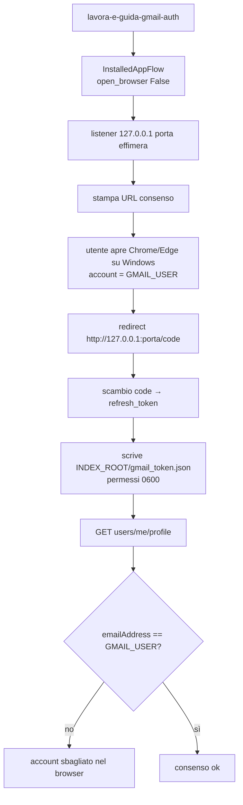
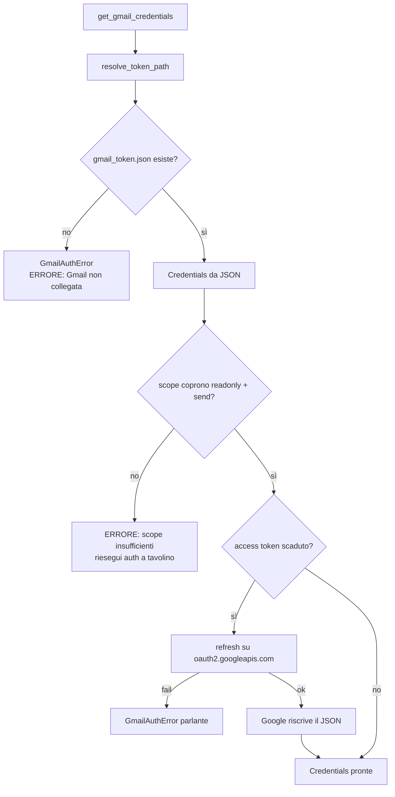
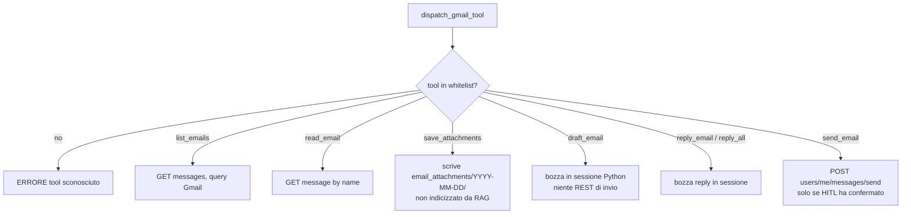
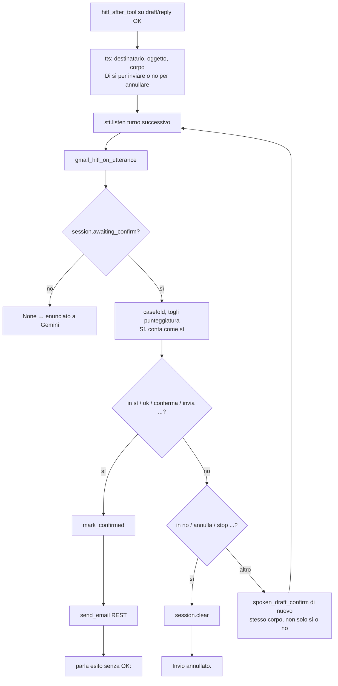

# Flowchart: Gmail OAuth e HITL invio

Indice: [flowchart.md](flowchart.md). Operativo: [gmail_oauth.md](gmail_oauth.md). Codice: [`gmail/oauth.py`](../src/lavora_e_guida/gmail/oauth.py), [`gmail/agent.py`](../src/lavora_e_guida/gmail/agent.py), [`gmail/send.py`](../src/lavora_e_guida/gmail/send.py), CLI [`gmail/auth_cli.py`](../src/lavora_e_guida/gmail/auth_cli.py).

Il consenso OAuth **non** parte dal loop vocale. Un enunciato solo non invia: serve HITL sì/no sul loop esterno.

## 1. Consenso a tavolino (`lavora-e-guida-gmail-auth`)

Client OAuth tipo **Desktop**, un solo file token. Runtime chiede `gmail.readonly` + `gmail.send`. `gmail.modify` è dichiarato in Console per il futuro, non nel codice.

Re-auth incrementale: stesso comando, `include_granted_scopes=true`. Google **aggiunge** send senza togliere readonly. Stesso JSON su disco.

Networking: mirrored WSL fa arrivare il redirect al listener Linux. In NAT puro il browser Windows non raggiunge `127.0.0.1` di WSL.

## 2. Token a runtime (mai un browser)

Chi chiama il gate:

- `--agent gmail` all’avvio: `_require_gmail_token` → `SystemExit(1)` se manca.
- `--agent master` all’avvio: **niente**. Al primo `ask_gmail`, `gmail_token_is_present` (solo `is_file`, niente refresh). Assenza → `ERRORE:` parlante, nested Gemini non parte.

## 3. Tool vocali mailbox

Gli id messaggio restano in Python. Gemini passa `name` (indice parlato: «la seconda») o `query`.

`draft` / `reply` / `reply_all` con `OK:` attivano `gmail_hitl_after_tool`: il TTS parla la conferma (senza prefisso `OK:`) e **salta** Gemini.

## 4. HITL sì / no

Il master inoltra lo stesso interceptor (`gmail_hitl_on_utterance`) e ferma Gemini master con `master_hitl_after_tool` se la sessione è in attesa. Nested Gmail **non** ascolta: l’ascolto resta sul loop esterno.

## 5. Errori HTTP parlanti

401/403 → «Gmail non collegata». 429 → occupata. 400 in send → destinatari. Timeout → non raggiungibile. Niente JSON error Gmail nel TTS.
