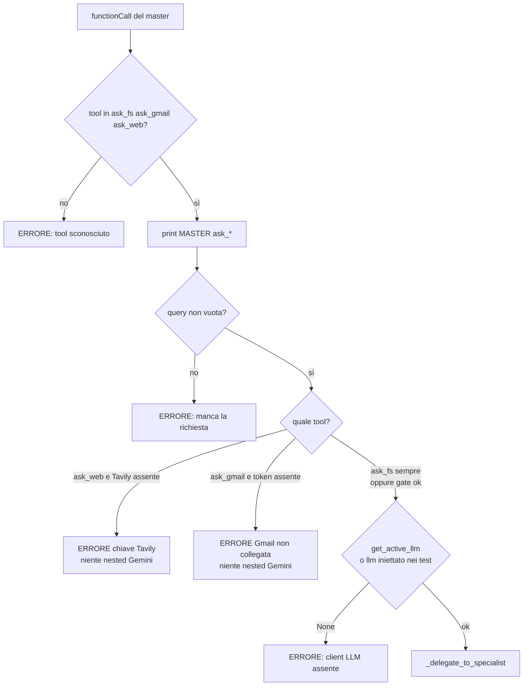
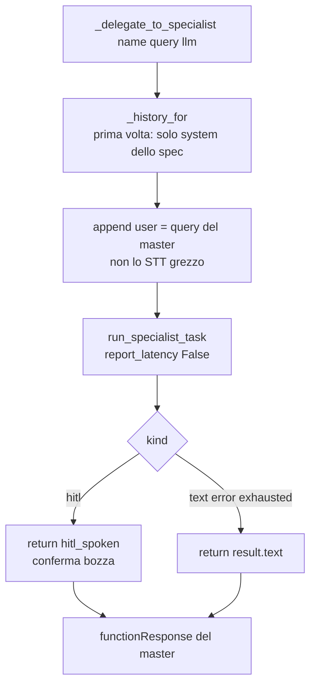
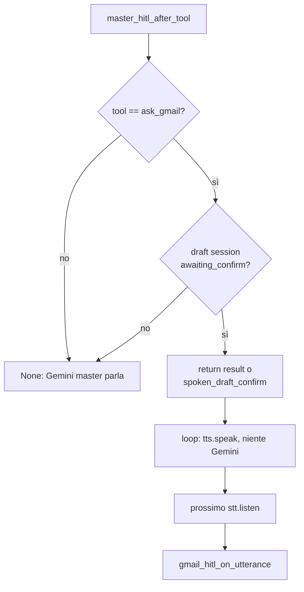
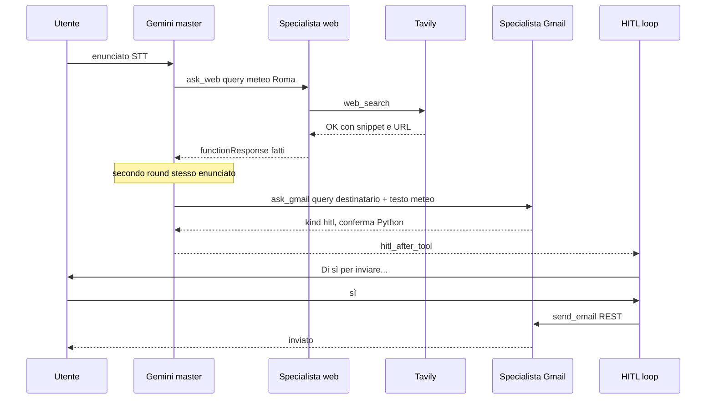
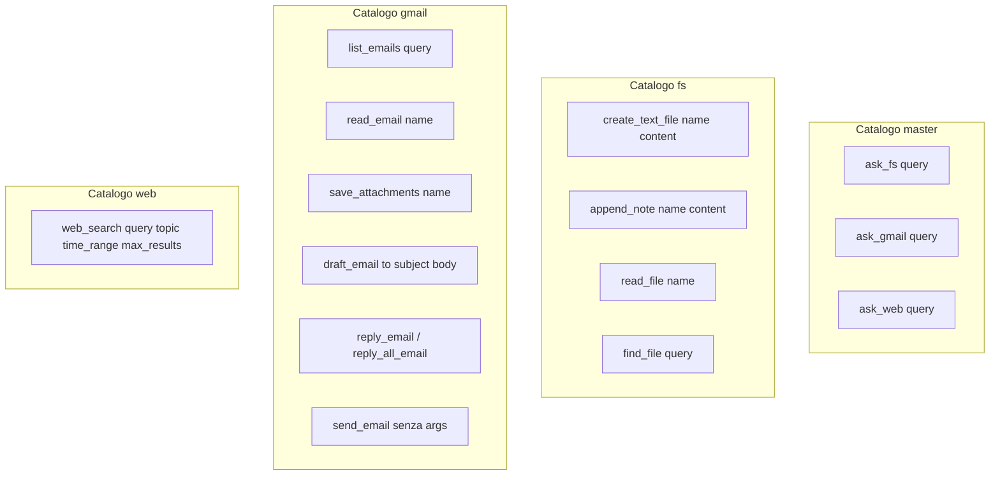
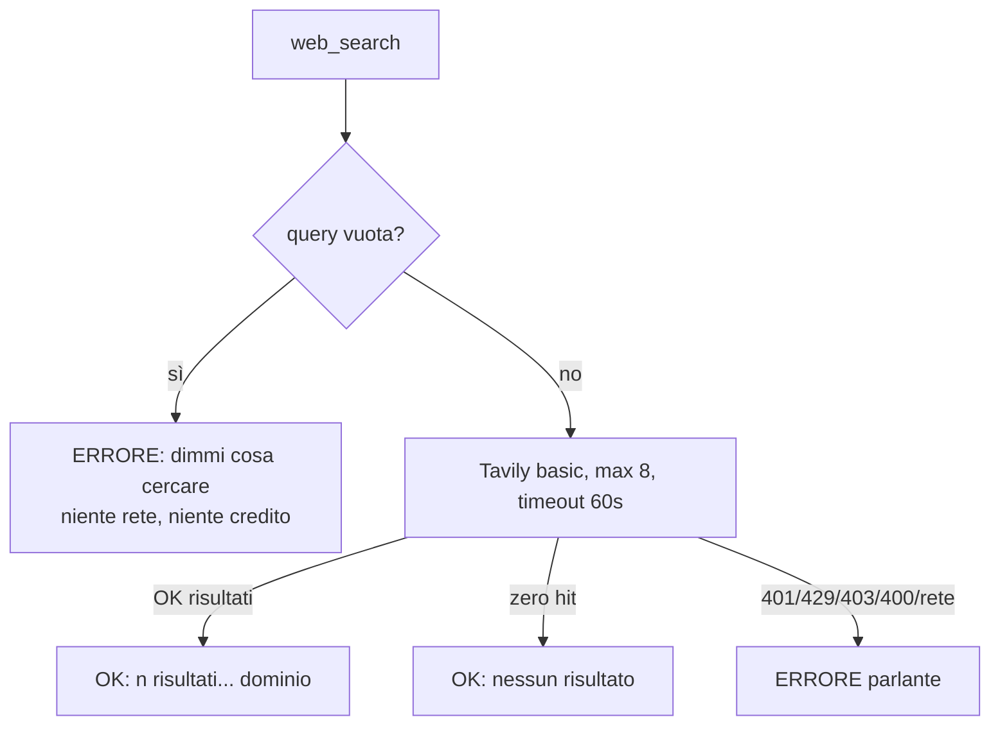

# Flowchart: router master e specialisti nested

Indice: [flowchart.md](flowchart.md). Codice: [`master/agent.py`](../src/lavora_e_guida/master/agent.py). Loop interno: [avvio e loop](flowchart_avvio_e_loop.md).

Il master è l’unico possessore di STT/TTS quando `--agent master`. Gemini del master vede **solo** `ask_fs`, `ask_gmail`, `ask_web`. I cataloghi di dominio restano negli specialisti.

## 1. Dispatch `ask_*`

Gate lazy: il processo master è già partito (serve il Desktop per `ask_fs`). L’errore è parlante, non `SystemExit`.

## 2. Nested: storia isolata, niente TTS

Ogni specialista ha una lista di messaggi propria, con **il suo** system prompt. Persiste per la sessione: «leggi la seconda» dopo «ultime email» vede la lista Gmail, non il prompt FS.

Stdout nested resta: `[FS]`, `[RAG]`, `[GMAIL]`, `[WEB]`. La latenza chat del nested non si ristampa: quella del round master è già sul loop esterno.

Dopo il `functionResponse`, Gemini del master formula la reply **con i fatti**, non «ho smistato». Se l’esito è `ERRORE:`, deve dirlo e fermarsi.

## 3. HITL Gmail sul loop esterno

Lo specialista nested ferma il **suo** Gemini (`kind=hitl`). Il master deve fermare anche il proprio, altrimenti riformula «ho chiesto a Gmail».

Sì / no: [flowchart Gmail](flowchart_gmail.md).

## 4. Flusso composto: meteo + email

Enunciato: «Cerca il meteo di Roma e mandalo a mario@x.it». Nessun `create_text_file`.

## 5. Cosa vede ogni Gemini

Il master **non** importa `web_search` né `create_text_file` nelle declaration. Se Gemini inventa un nome di dominio, il dispatch risponde `ERRORE: tool sconosciuto`.

## 6. Specialista web in due parole

Niente HITL: la ricerca è read-only. `include_answer=False`: la sintesi parlata la scrive Gemini, non Tavily. Fonti a voce = dominio (`ansa.it`); URL completi solo in appendice, da leggere se l’utente li chiede. Dettaglio operativo: [tavily_web.md](tavily_web.md).

## 7. Specialista fs in due parole

Path risolto in Python: Gemini passa solo `name` o `query`. `find_file` usa Chroma. Create/append dopo la scrittura chiamano `upsert_indexed_file`. Dettaglio: [file e RAG](flowchart_fs_rag.md).
